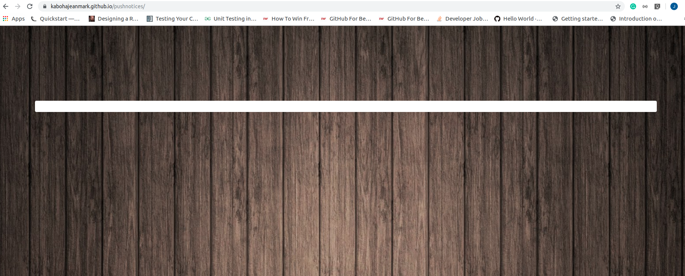

# ah-haven pushnotices
The purpose of this repo is to host a page to receive push notifications sent from running the app authors-haven backend. It displays them live as they happen.

### Illustrations
The page that views the push notifications.

### Demo
A live demo of the application is found [here](https://kabohajeanmark.github.io/pushnotices/)

### Tech Stack
- HTML5
- CSS3
- Javascript